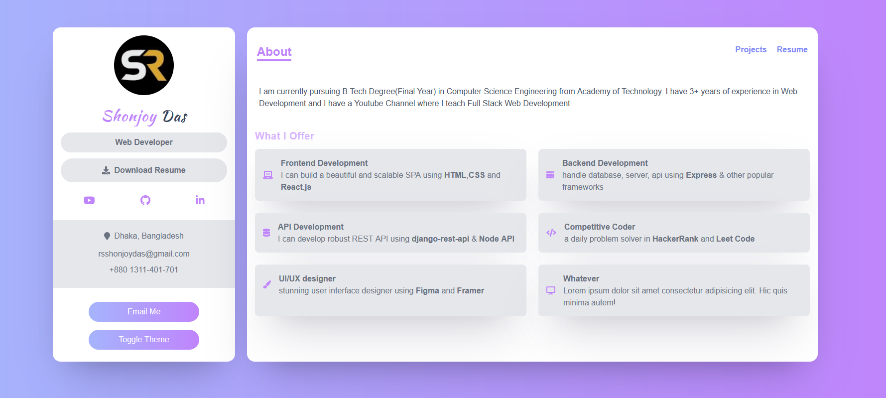
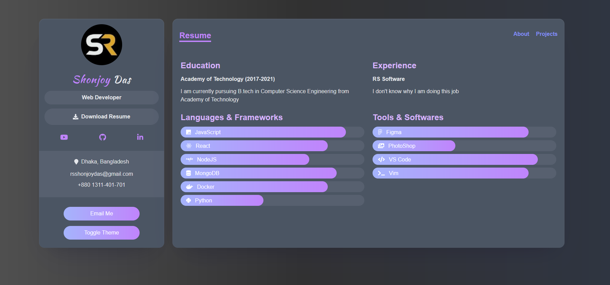

[![Facebook-Page][facebook-shield]][facebook-url]
[![Twitter][twitter-shield]][twitter-url]
[![Instagram][instagram-shield]][instagram-url]
[![LinkedIn][linkedin-shield]][linkedin-url]

<p align="center">
  <h3 align="center">Developer portfolio
  <div align="center"><h3>Project Link: <a href="https://github.com/rsshonjoydas/portfolio">GitHub</a> or <a href="https://codesandbox.io/s/github/rsshonjoydas/portfolio/tree/master">CodeSandbox</a> & <a href="https://portfolio-rsshonjoydas.vercel.app/">Live</a></h3></div>

### Developer Portfolio made with Next JS Framer Motion and TypeScript.

#### Light Theme

---



#### Dark Theme

---



## Installation

```bash
npm run dev
```

## The project is deployed on Vercel :

[Deployed Version](https://portfolio-rsshonjoydas.vercel.app/)

## Contributing

Pull requests are welcome. For major changes, please open an issue first to discuss what you would like to change.

---

## Contact

Shonjoy Das- [rsshonjoydas@gmail.com](mailto:rsshonjoydas@gmail.com)

## License

[MIT](https://choosealicense.com/licenses/mit/)

<!-- MARKDOWN LINKS & IMAGES -->

[facebook-shield]: https://img.shields.io/badge/-Facebook-black.svg?style=flat-square&logo=facebook&color=555&logoColor
[facebook-url]: https://facebook.com/rsshonjoydas
[twitter-shield]: https://img.shields.io/badge/-Facebook-black.svg?style=flat-square&logo=twitter&color=555&logoColor
[twitter-url]: https://twitter.com/rsshonjoydas
[instagram-shield]: https://img.shields.io/badge/-Instagram-black.svg?style=flat-square&logo=instagram&color=555&logoColor
[instagram-url]: https://instagram.com/rsshonjoydas
[linkedin-shield]: https://img.shields.io/badge/-LinkedIn-black.svg?style=flat-square&logo=linkedin&colorB
[linkedin-url]: https://linkedin.com/in/rsshonjoydas
